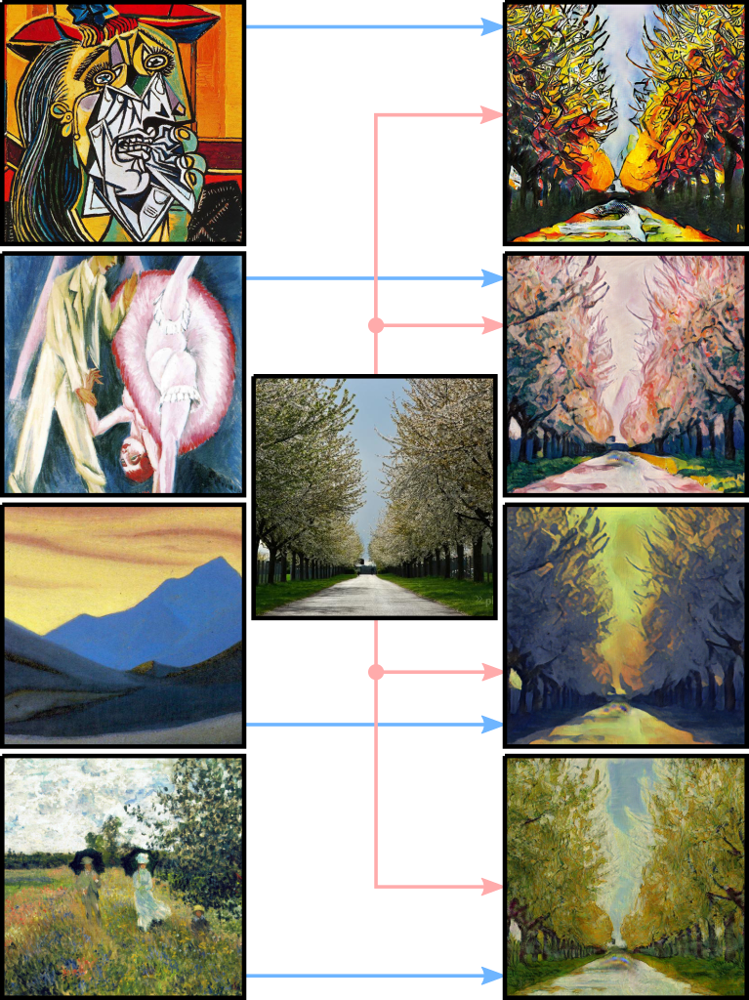
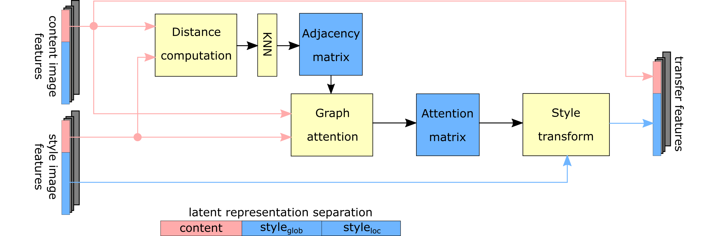

## Two-Stage Peer-Regularized Feature Recombination for Arbitrary Image Style Transfer
[Paper on arXiv](https://arxiv.org/pdf/1906.02913.pdf)

Public PyTorch implementation of two-stage peer-regularized feature recombination for arbitrary image style transfer presented at CVPR 2020.
The model is trained on a selected set painters and generalizes well even to previously unseen style during testing.

<div align="center"></div>

<!--  -->

### Structure

The repository contains the code that we have used to produce some of the main results in the paper. We have left out additional modifications that were used to generate the ablation studies, etc.

## Running examples

In order to get reasonable runtime, the code has to be run on a GPU. The code is multi-gpu ready. We have used 2 GPUs for training and a single GPU during test time. We have been running our code on a *Nvidia Titan X (Pascal) 12GB GPU*. Basic system requirements are to be found [here](docs/dependencies.md).

Should you encounter some issues running the code, please first check [Known issues](docs/issues.md) and then consider opening a new issue in this repository.

### Model training

The provided pre-trained model was trained by running the following command:
```
python train.py --dataroot photo2painter13 --checkpoints_dir=./checkpoints --dataset_mode=painters13 --name GanAuxModel --model gan_aux
--netG=resnet_residual --netD=disc_noisy --display_env=GanAuxModel --gpu_ids=0,1 --lambda_gen=1.0 --lambda_disc=1.0 --lambda_cycle=1.0
--lambda_cont=1.0 --lambda_style=1.0 --lambda_idt=25.0 --num_style_samples=1 --batch_size=2 --num_threads=8 --fineSize=256 --loadSize=286
--mapping_mode=one_to_all --knn=5 --ml_margin=1.0 --lr=4e-4 --peer_reg=bidir --print_freq=500 --niter=50 --niter_decay=150 --no_html
```

### Model testing

We provide one pre-trained model that you can run and stylize images. The example below will use sample content and style images from the `samples/data` folder.

The pretrained model was trained on images with resolution 256 x 256, during test time it can however operate on images of arbitrary size. Current memory limitations restrict us to run images of size up to 768 x 768.
```
python test.py --checkpoints_dir=./samples/models --name GanAuxPretrained --model gan_aux --netG=resnet_residual --netD=disc_noisy
--gpu_ids=0 --num_style_samples=1 --loadSize=512 --fineSize=512 --knn=5 --peer_reg=bidir --epoch=200 --content_folder content_imgs
--style_folder style_imgs --output_folder out_imgs
```

## Datasets
The full dataset that we have used for training is the same one as in [this work](https://github.com/CompVis/adaptive-style-transfer).

<!--, can be downloaded [here](). -->

## Results

### Comparison to existing approaches


### Ablation study


## Reference
If you make any use of our code or data, please cite the following:
```
@conference{svoboda2020twostage,
  title={Two-Stage Peer-Regularized Feature Recombination for Arbitrary Image Style Transfer},
  author={Svoboda, J. and Anoosheh, A. and Osendorfer, Ch. and Masci, J.},
  booktitle={Proceedings of the Conference on Computer Vision and Pattern Recognition (CVPR)},
  year={2020}
}
```

## Acknowledgments
The code in this repository is based on [pytorch-CycleGAN](https://github.com/junyanz/pytorch-CycleGAN-and-pix2pix).

For any reuse and or redistribution of the code in this repository please follow the [license agreement](./LICENSE) attached to this repository.
